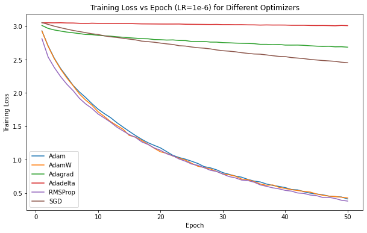
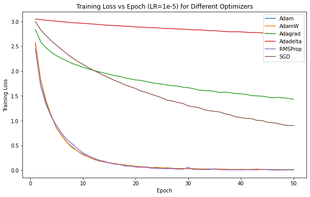
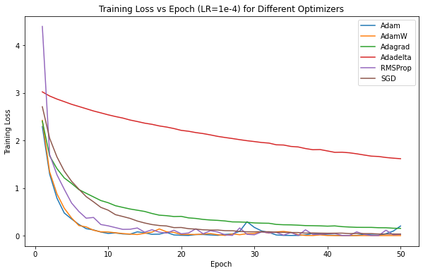
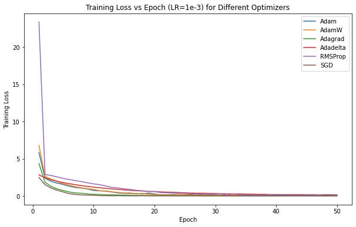
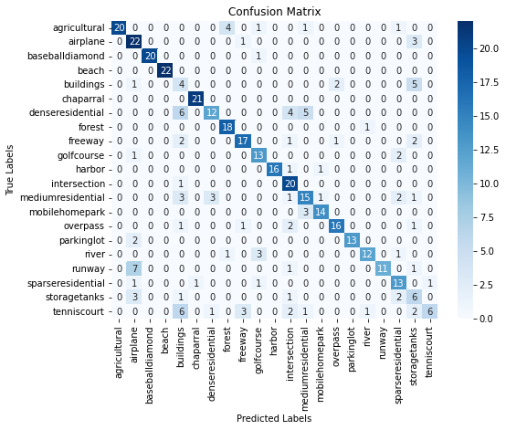

# GNR 638 Assignment 4

**Done by:**

- Aditya Anand (21D070007)
- Shounak Das (21D070068)


This repository contains the solution for Assignment 4 of the GNR 638 course.

Please use light mode in GitHub as in Dark mode, the plot axes and labels are not visible.


We used our CNN which we had defined in Assignment 3 and we used different Optimisers-
```
  ["Adam", "AdamW", "Adagrad", "Adadelta", "RMSProp", "SGD"]
  ```
and starting learning rates-
  ```
  [1e-6, 1e-5, 1e-4, 1e-3]
  ```

### Results

#### Train Loss vs. Epoch for different Optimisers:

- **For lr = 1e-6:**  
    
- **For lr = 1e-5:**  
    
- **For lr = 1e-4:**  
    
- **For lr = 1e-3:**  
    


Best model (Optimizer: Adam, LR: 0.0001) val accuracy: 0.8095238095238095 test accuracy: 0.7387

Our test accuracy is roughly 7% lower than the best val accuracy, most likely due to overfitting. This could be prevented by adding DropBlock layers in our CNN (Like we did in Assignment 3).




#### Class-wise Accuracy:
                    precision    recall  f1-score   support

     agricultural       1.00      0.74      0.85        27
         airplane       0.59      0.85      0.70        26
    baseballdiamond     1.00      0.95      0.98        21
            beach       1.00      1.00      1.00        22
        buildings       0.17      0.33      0.22        12
        chaparral       0.95      1.00      0.98        21
    denseresidential    0.75      0.44      0.56        27
           forest       0.78      0.95      0.86        19
          freeway       0.77      0.74      0.76        23
       golfcourse       0.68      0.81      0.74        16
           harbor       1.00      0.89      0.94        18
     intersection       0.61      0.95      0.74        21
    mediumresidential   0.60      0.58      0.59        26
    mobilehomepark      0.88      0.82      0.85        17
         overpass       0.84      0.76      0.80        21
       parkinglot       1.00      0.87      0.93        15
            river       0.86      0.71      0.77        17
           runway       1.00      0.55      0.71        20
    sparseresidential   0.62      0.76      0.68        17
     storagetanks       0.29      0.46      0.35        13
      tenniscourt       0.86      0.27      0.41        22

         accuracy                           0.74       421
        macro avg       0.77      0.74      0.73       421
     weighted avg       0.79      0.74      0.74       421
